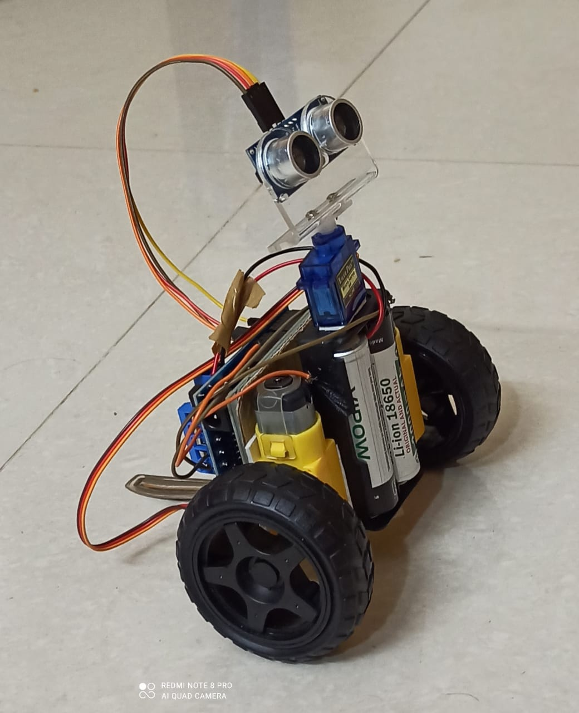

# Obstacle Avoiding Robot

This Arduino-based **Obstacle Avoiding Robot** uses an ultrasonic sensor to detect obstacles and intelligently navigate around them. The bot is equipped with a servo motor for directional sensing and DC motors for movement, making it capable of autonomously avoiding collisions.

  
*Image 1: Top view of the obstacle-avoiding robot.*

*Image 2: Video of robot working.*

---

## Features
- **Ultrasonic Sensor Integration**: Detects obstacles in the robot's path.
- **Servo-Controlled Direction**: Enables the robot to scan left and right for the best path.
- **Autonomous Navigation**: Adjusts movement dynamically to avoid obstacles.
- **Customizable Speed**: DC motor speed can be fine-tuned in the code.

---

## Getting Started

### Prerequisites
Ensure you have the following libraries installed:
1. **AFMotor Library**: [Installation Guide](https://learn.adafruit.com/adafruit-motor-shield/library-install)
2. **NewPing Library**: [Installation Guide](https://github.com/livetronic/Arduino-NewPing)
3. **Servo Library**: [Installation Guide](https://github.com/arduino-libraries/Servo.git)

### Installation
1. Download the libraries from the links above.
2. Open Arduino IDE.
3. Navigate to `Sketch > Include Library > Add .ZIP Library`.
4. Select the downloaded `.zip` files to install the libraries.

---

## How It Works
1. **Obstacle Detection**: The ultrasonic sensor continuously measures the distance to obstacles.
2. **Decision Making**: If an obstacle is detected within a set range, the robot decides whether to turn left or right based on the available space.
3. **Movement**: The bot moves forward, backward, or adjusts its direction to avoid obstacles autonomously.

---

## Project Images
Include the following images in the project folder:
1. **Image 1**: A top view of the robot showcasing the components and layout.
2. **Video 1**: A video of robot working.